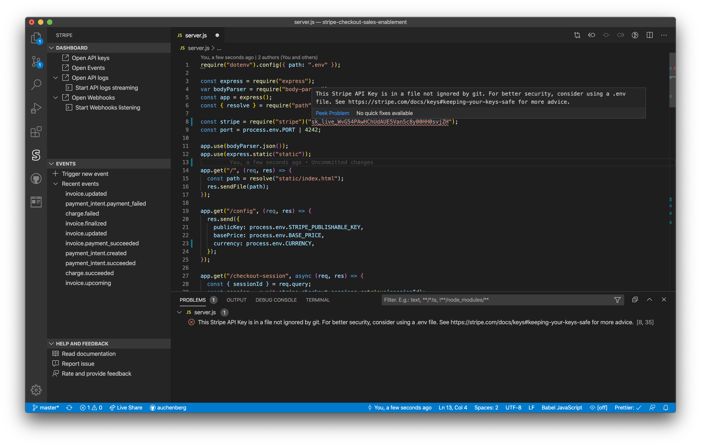

**NOTICE: This project is PRE-RELEASE and has not been released to the public. Please provide your feedback by sending an email to auchenberg@stripe.com or open issues here on GitHub. Don't talk about this project in public. Yet.**

<h1 align="center">
  <br>
    
  <br>
  Stripe for Visual Studio Code
  <br>
  <br>
</h1>

<h4 align="center">Bringing you Stripe inside your editor.</h4>

Stripe for VS Code is a new extension for Visual Studio Code that enables developers to have an easier integration experience with Stripe by having easy access to Stripe specific information such as code snippets, API requests logs and events directly from their editor.

Stripe for VS Code works by extending VS Code with a new “Stripe” panel in the activity bar, provides code snippets for top languages, debug configurations and extends the command palette with Stripe specific commands to make workflows easier.



## Getting started

1. Go to [releases](https://github.com/stripe/vscode-stripe/releases) and download the `.VSIX` file from the latest release
2. See the VS Code docs on [how to install the VSIX](https://code.visualstudio.com/docs/editor/extension-gallery#_install-from-a-vsix)
3. Once installed, click the new Stripe icon in the Activity Bar or explore the new Stripe commands in the command palette.

Make sure you have the [Stripe CLI](https://stripe.com/docs/stripe-cli) installed on your computer.

## Features

- Easy access to key sections of the Stripe developer dashboard
- See recent events from Stripe and trigger new ones.
- Realtime API logs inside the integrated terminal
- Listen for and forward webhooks traffic to your local machine via commands and debug configurations.
- Linting of Stripe API keys to make sure you don't expose them by mistake.
- Inline links to Stripe API reference when hovering over Stripe library code.
- JavaScript code snippets for most common Stripe API scenarios

### Stripe API key linting

The built-in API key linter checks for Stripe API keys inside your source code, and warns you if you expose an API key inside your code.

Test-mode keys will be treated as warnings, and live-mode keys will be marked as problems.

### Listen to webhooks traffic with debugging

You can listen for and forward webhooks traffic to your local machine by either running the command `Stripe: "Start Webhooks events listening with CLI` or by creating a debug configuration that allows you to launch webhooks forwarding when starting debugging or pressing `F5`.

The Stripe debug configuration can be combined with other configurations, so you with one click/press can launch both Stripe and your local API instance.

```json
{
  "version": "0.2.0",
  "configurations": [
    {
      "name": "Stripe: Webhooks listen",
      "type": "stripe",
      "request": "launch",
      "command": "listen",
      "localUrl": "http://localhost:3000/stripe-events"
    }
  ]
}
```

For the `stripe` debug configuration you can also specify `localUrl` which is the URL of your local server that should receive your webhooks traffic. You can also specify `events` which is an optional array that allows you to filter which events you want to have forwarded.

#### Compound configurations

You can combine the `stripe` debug configuration with `compounds` configurations to have one configuration that launches your API and stripe at the same time:

```
{
  "version": "0.2.0",
  "configurations": [
    {
      "name": "Stripe: Webhooks listen",
      "type": "stripe",
      "request": "launch",
      "command": "listen",
      "localUrl": "http://localhost:3000/stripe-events",
      "events": ["payment_intent.succeeded", "payment_intent.canceled"] // Optional array if only specific events are wanted
    },
    {
      "type": "node",
      "request": "launch",
      "name": "Node: Launch Program",
      "program": "${workspaceFolder}/examples/standalone.js",
      "skipFiles": ["<node_internals>/**"]
    }
  ],
  "compounds": [
    {
      "name": "Launch: Stripe + API",
      "configurations": ["Node: Launch Program", "Stripe: Webhooks listen"]
    }
  ]
}
```

## Developing this extension

1. Checkout this repo
1. Run `npm install` in terminal to install dependencies
1. Run the `Run Extension` target in the Debug View or simply press `F5` This will:
   - Start a task `npm: watch` to compile the code
   - Run the extension in a new VS Code window

## Telemetry

The Stripe VS Code Extension collects basic telemetry in order to improve this extension's experience. If you'd like to opt out we respect the [global telemetry setting in VS Code](https://code.visualstudio.com/docs/getstarted/telemetry), so we won't collect any data unless this setting is turned on.

## License

See [LICENSE.md](LICENSE.md)

## Third-Party Notices

| Name                               | Description                                                         | Version |    Size | License |
| :--------------------------------- | :------------------------------------------------------------------ | :------ | ------: | :-----: |
| @types/universal-analytics         | TypeScript definitions for universal-analytics                      | 0.4.4   | unknown |   MIT   |
| execa                              | Process execution for humans                                        | 4.0.0   |     28k |   MIT   |
| moment                             | Parse, validate, manipulate, and display dates                      | 2.24.0  |  276.8k |   MIT   |
| os-name                            | Get the name of the current operating system. Example: macOS Sierra | 3.1.0   |   35.4k |   MIT   |
| public-ip                          | Get your public IP address - very fast!                             | 4.0.1   |    2.6k |   MIT   |
| universal-analytics                | A node module for Google's Universal Analytics tracking             | 0.4.20  |  673.9k |   MIT   |
| vscode-languageclient              | VSCode Language client implementation                               | 6.1.3   |  183.9k |   MIT   |
| vscode-languageserver              | Language server implementation for node                             | 6.1.1   |   91.5k |   MIT   |
| vscode-languageserver-textdocument | A simple text document implementation for Node LSP servers          | 1.0.1   |    3.8k |   MIT   |

## Code of Conduct

This project has adopted the Stripe Code of Conduct. See [CODE_OF_CONDUCT.md](CODE_OF_CONDUCT.md)
