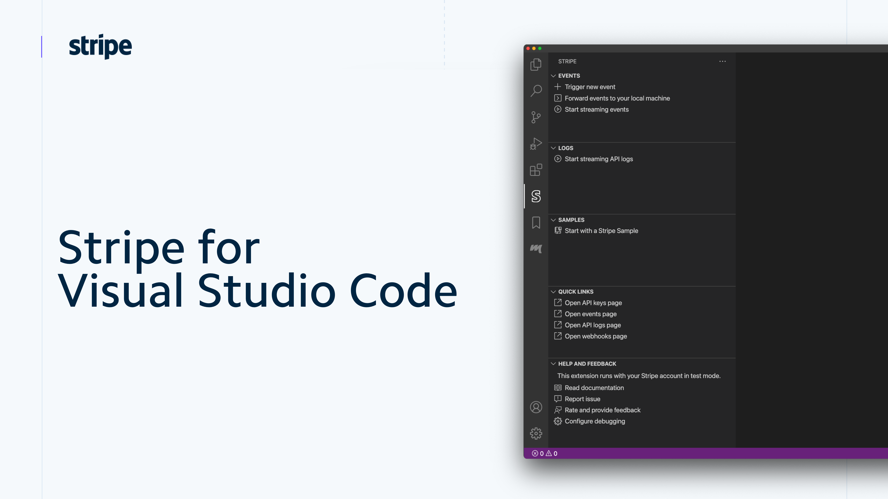

<h1 align="center">
   
    
   
  Stripe for Visual Studio Code
   
   
</h1>

<h4 align="center">Build, test, and use Stripe inside your editor.</h4>

Stripe’s extension for Visual Studio Code makes it easy to generate sample code, view API request logs, forward events to your application, and use Stripe within your editor.

A new Stripe panel in the activity bar provides easy access to code snippets for several languages, adds debug configurations, and extends the command palette with common developer workflows.

Read more about this extension in the official Stripe documentation at [https://stripe.com/docs/stripe-vscode](https://stripe.com/docs/stripe-vscode)

## Contributions

Stripe for Visual Studio Code is an open source project, and is currently in **public beta**. We do development in the open, where our [issue tracker](https://github.com/stripe/vscode-stripe/issues) is public here in GitHub.

Contributions and feedback to the project are welcome, so please open issues for feature requests, questions and alike.

### Developing this extension

1. Checkout this repo
1. Run `npm install` in terminal to install dependencies
1. Run the `Run Extension` target in the Debug View or simply press `F5` This will:
   - Start a task `npm: watch` to compile the code
   - Run the extension in a new VS Code window

## License

See [LICENSE.md](LICENSE.md)
## Telemetry

The Stripe VS Code Extension collects basic telemetry in order to improve this extension's experience. If you'd like to opt out we respect the [global telemetry setting in VS Code](https://code.visualstudio.com/docs/getstarted/telemetry), so we won't collect any data unless this setting is turned on.

## Third-Party Notices

| Name                               | Description                                                         | Version |    Size | License |
| :--------------------------------- | :------------------------------------------------------------------ | :------ | ------: | :-----: |
| @types/universal-analytics         | TypeScript definitions for universal-analytics                      | 0.4.4   | unknown |   MIT   |
| execa                              | Process execution for humans                                        | 4.0.0   |   24.9k |   MIT   |
| moment                             | Parse, validate, manipulate, and display dates                      | 2.24.0  |  288.4k |   MIT   |
| os-name                            | Get the name of the current operating system. Example: macOS Sierra | 3.1.0   |   29.9k |   MIT   |
| ps-list                            | Get running processes                                               | 7.1.0   |    2.4k |   MIT   |
| public-ip                          | Get your public IP address - very fast!                             | 4.0.1   |    2.9k |   MIT   |
| universal-analytics                | A node module for Google's Universal Analytics tracking             | 0.4.20  |  703.7k |   MIT   |
| vscode-languageclient              | VSCode Language client implementation                               | 6.1.3   |  215.3k |   MIT   |
| vscode-languageserver              | Language server implementation for node                             | 6.1.1   |  121.9k |   MIT   |
| vscode-languageserver-textdocument | A simple text document implementation for Node LSP servers          | 1.0.1   |    3.8k |   MIT   |

## Code of Conduct

This project has adopted the Stripe Code of Conduct. See [CODE_OF_CONDUCT.md](CODE_OF_CONDUCT.md)
